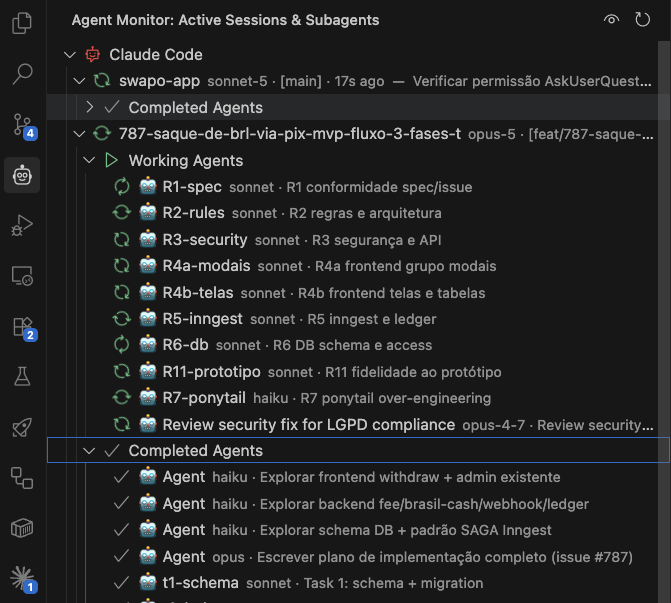

# AgentVille

See every **Claude Code** and **Google Antigravity** agent running on your machine —
sessions, subagents, models and live status — in one place inside VS Code.



## Features

- **Sessions grouped by tool** — Claude Code and Google Antigravity under separate brand nodes.
- **Per session**: project, git branch, last-active time, session title (first user prompt), and the **LLM model** in use.
- **Working sessions surface first** — sessions still working sort to the top of the list, ahead of idle ones, and show `working` in place of a relative timestamp (a subagent writes to its own log file, so its parent session's last-write clock can go quiet while the subagent is still live).
- **Subagents** — split into _Working_ and _Completed_, each row showing its real name and model (e.g. `explorer-agent · haiku`), read from the metadata Claude Code writes alongside each subagent's transcript, plus its task.
- **Model badges** (Claude Code): session model from the assistant stream (e.g. `sonnet-5`), and each subagent's own model, falling back to the session model when inherited. _(Antigravity logs carry no model info, so no badge there.)_
- **Real-time updates** via file watchers, plus a 15s safety refresh.
- **Active detection** — a session is marked active on a recent write, a reply it still owes, a long _thinking_ turn, or while any of its subagents — including a background agent it launched that runs in its own log file — are still working. `lsof` is also checked on macOS/Linux as a secondary signal (it rarely finds anything, since the log file's descriptor isn't held open between appends), and is skipped entirely on Windows.
- **Startup delay** — waits ~10s on activation, showing a progress bar and loading state, so it doesn't compete with Claude Code for the log files while it boots.
- **Global on/off toggle** — an eye icon in the view title. Persisted as an application-scoped setting, so disabling it stops monitoring across **every** window/instance.

## Roadmap

> ⚠️ **Not built yet.** Everything below is planned, not shipped. What the extension does
> today is exactly the list above — a tree view. This section exists so you know where the
> project is going, not to describe features you can use.

The name is the plan: turn the tree into a **living 2D pixel office**.

- **The office** — a webview opened in an editor tab, rendering an open-floor pixel-art
  office. Every running session and subagent is a character on the floor; they walk in when
  an agent starts and leave when it finishes. A speech bubble follows each one showing what
  it is doing right now (`Editing logParser.ts`, `Running npm test`), and clicking it opens
  a side panel with that agent's most recent activity, live.
- **Situated behaviour** — characters walk to the furniture that matches their work:
  the bookshelf when reading a file, a desk when editing, the printer when running a
  command, the coffee machine when idle.
- **Progression** — XP and levels per agent type, achievements, a ranking of who worked
  the most, day/night cycle, and unlockable office decoration.

The tree view stays either way — the office is an additional surface, not a replacement.

## Requirements

- VS Code or Antigravity **≥ 1.90** (Antigravity 1.107.0 base is compatible).
- macOS, Linux, or Windows.
- Reads `~/.claude/projects/**/*.jsonl` and `~/.gemini/antigravity-ide/brain/**/transcript.jsonl` (`%USERPROFILE%` in place of `~` on Windows).

Everything runs locally. The extension reads log files already on your disk and never
sends anything anywhere.

## Claude Code compatibility

The parser depends on the Claude Code transcript format, which can change between releases.
Last validated against **Claude Code 2.1.223**. Claude Code stamps a `version` field on every
transcript line; when a newer one shows up in your logs, the extension shows a one-time
warning so you know the parser hasn't been re-checked against it yet. See
[docs/DEVELOPMENT.md](https://github.com/soumatheusgomes/agentville/blob/main/docs/DEVELOPMENT.md#claude-code-compatibility)
for how this is tracked.

## Install

### From the extension store (recommended)

Antigravity (and VSCodium, Gitpod, Cursor, Windsurf) ships the
[Open VSX Registry](https://open-vsx.org): open the **Extensions** view, search for
`AgentVille`, and install.

### From a downloaded `.vsix`

Grab the `.vsix` from the
[latest release](https://github.com/soumatheusgomes/agentville/releases/latest),
then install it:

```bash
# Antigravity
antigravity-ide --install-extension agentville-*.vsix --force

# VS Code
code --install-extension agentville-*.vsix --force
```

…or via the screen: **Extensions** view → `…` (top-right menu) → **Install from VSIX…** →
pick the file you downloaded.

Then reload the window (Command Palette → _Developer: Reload Window_). The 🤖 **AgentVille**
icon appears in the activity bar.

To uninstall: `antigravity-ide --uninstall-extension soumatheusgomes.agentville`.

## Configuration

| Setting              | Default | Scope       | Description                                                                                                               |
| -------------------- | ------- | ----------- | ------------------------------------------------------------------------------------------------------------------------- |
| `agentville.enabled` | `true`  | application | Monitor sessions. Disabling stops all log reading in every window; re-enable via the eye icon or by editing this setting. |

## Usage

- Open the **AgentVille** view from the activity bar.
- Expand a brand → a session → _Working_ / _Completed_ to see subagents.
- **Open Log File** / **Open Project Folder** are available on each session row (inline icons).
- Toggle monitoring on/off with the eye icon in the view title.

Want to build or modify the extension instead? See
[docs/DEVELOPMENT.md](https://github.com/soumatheusgomes/agentville/blob/main/docs/DEVELOPMENT.md).

## License

[Apache License 2.0](https://github.com/soumatheusgomes/agentville/blob/main/LICENSE) — Copyright 2026 Matheus Gomes.

Free to use, modify, extend and redistribute, including commercially — **provided you keep
the attribution**. Section 4 of the License requires every copy or derivative work to retain
the [NOTICE](https://github.com/soumatheusgomes/agentville/blob/main/NOTICE) file, which credits the original author and links back to this
repository, to preserve the existing copyright notices, and to state which files were
changed. Stripping that attribution is a licence violation.
